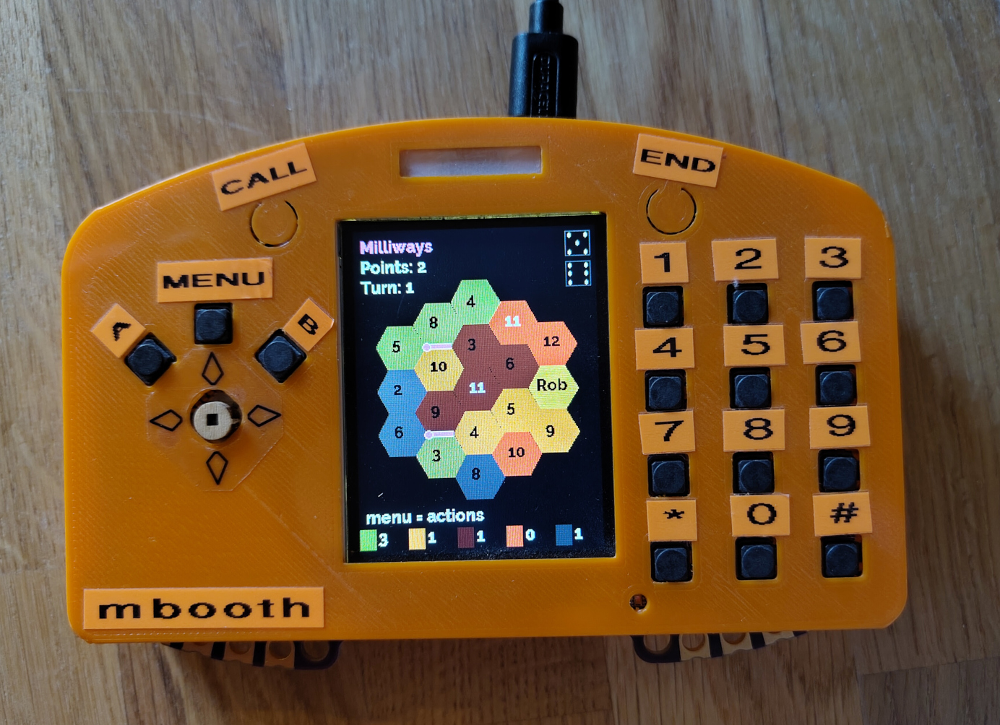

# Settlers of EMF

> After a long voyage and great deprivation of wifi, your vehicles have finally reached the edge of an uncharted field at the foot of a great castle. ***The Electromagnetic Field!***
> 
> But you are not the only discoverer. Other fearless voyagers have also arrived at the foot the castle; the race to settle the Electromagnetic Field has begun!

**Settlers of EMF** is a pass-and-play game of ruthless strategy for up to 4 players of all ages.

### History

This is a port of the same **Settlers of EMF** game I wrote for the TiLDA Mk4 badge in 2018. The original code for that version of the game is preserved in the [TiLDA-Mk4](https://github.com/mbooth101/emf-settlers/tree/TiLDA-Mk4) branch.

The 3D printed TiLDA Mk4 case is by [Nightcaster](https://github.com/nightcaster), plans [available from Printables](https://www.printables.com/model/1642943-tilda-mk4-case-emf-2018-badge).

### License

This repo is MIT licensed.
